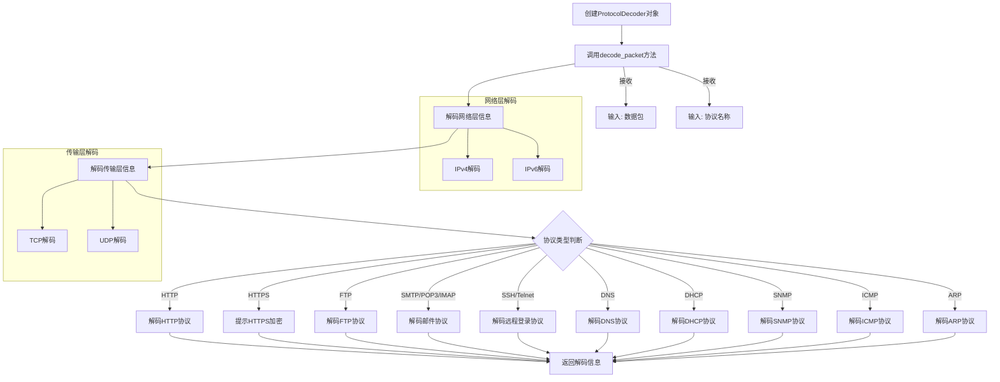

```mermaid
flowchart TD
    A[创建ProtocolDecoder对象]
    B[调用decode_packet方法]
    C[输入: 数据包]
    D[输入: 协议名称]
    
    A --> B
    B -->|接收| C
    B -->|接收| D
    
    B --> E[解码网络层信息]
    E --> F[解码传输层信息]
    F --> G{协议类型判断}
    
    G -->|HTTP| H[解码HTTP协议]
    G -->|HTTPS| I[提示HTTPS加密]
    G -->|FTP| J[解码FTP协议]
    G -->|SMTP/POP3/IMAP| K[解码邮件协议]
    G -->|SSH/Telnet| L[解码远程登录协议]
    G -->|DNS| M[解码DNS协议]
    G -->|DHCP| N[解码DHCP协议]
    G -->|SNMP| O[解码SNMP协议]
    G -->|ICMP| P[解码ICMP协议]
    G -->|ARP| Q[解码ARP协议]
    
    H --> R[返回解码信息]
    I --> R
    J --> R
    K --> R
    L --> R
    M --> R
    N --> R
    O --> R
    P --> R
    Q --> R
    
    subgraph 网络层解码
    E1[IPv4解码]
    E2[IPv6解码]
    E --> E1
    E --> E2
    end
    
    subgraph 传输层解码
    F1[TCP解码]
    F2[UDP解码]
    F --> F1
    F --> F2
    end
```