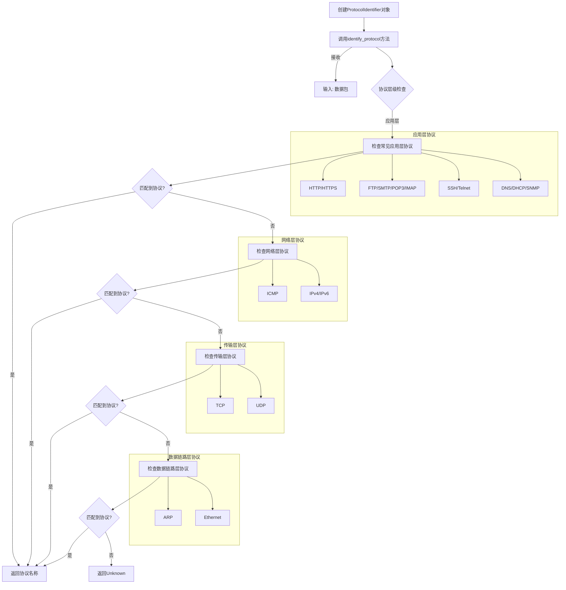

```mermaid
flowchart TD
    A[创建ProtocolIdentifier对象]
    B[调用identify_protocol方法]
    C[输入: 数据包]
    
    A --> B
    B -->|接收| C
    
    B --> D{协议层级检查}
    
    D -->|应用层| D1[检查常见应用层协议]
    D1 --> D1a{匹配到协议?}
    D1a -->|是| R1[返回协议名称]
    D1a -->|否| D2[检查网络层协议]
    
    D2 --> D2a{匹配到协议?}
    D2a -->|是| R1
    D2a -->|否| D3[检查传输层协议]
    
    D3 --> D3a{匹配到协议?}
    D3a -->|是| R1
    D3a -->|否| D4[检查数据链路层协议]
    
    D4 --> D4a{匹配到协议?}
    D4a -->|是| R1
    D4a -->|否| R2[返回Unknown]
    
    subgraph 应用层协议
    AL1[HTTP/HTTPS]
    AL2[FTP/SMTP/POP3/IMAP]
    AL3[SSH/Telnet]
    AL4[DNS/DHCP/SNMP]
    D1 --> AL1
    D1 --> AL2
    D1 --> AL3
    D1 --> AL4
    end
    
    subgraph 网络层协议
    NL1[ICMP]
    NL2[IPv4/IPv6]
    D2 --> NL1
    D2 --> NL2
    end
    
    subgraph 传输层协议
    TL1[TCP]
    TL2[UDP]
    D3 --> TL1
    D3 --> TL2
    end
    
    subgraph 数据链路层协议
    DLL1[ARP]
    DLL2[Ethernet]
    D4 --> DLL1
    D4 --> DLL2
    end
```