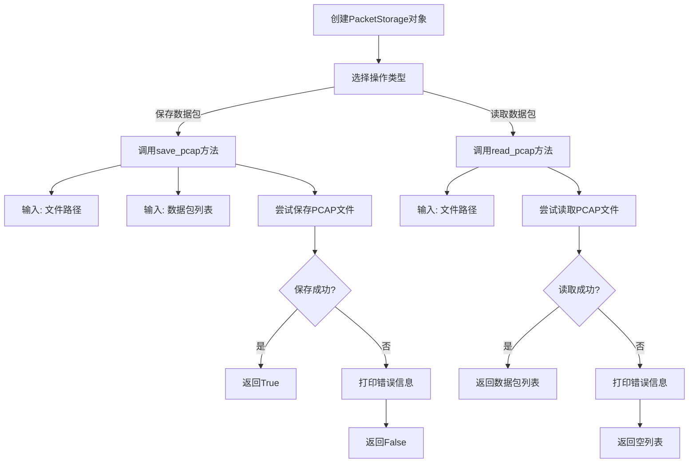

```mermaid
flowchart TD
    A[创建PacketStorage对象]
    B[选择操作类型]
    
    A --> B
    
    B -->|保存数据包| C[调用save_pcap方法]
    B -->|读取数据包| D[调用read_pcap方法]
    
    C --> C1[输入: 文件路径]
    C --> C2[输入: 数据包列表]
    C --> C3[尝试保存PCAP文件]
    C3 --> C4{保存成功?}
    C4 -->|是| C5[返回True]
    C4 -->|否| C6[打印错误信息]
    C6 --> C7[返回False]
    
    D --> D1[输入: 文件路径]
    D --> D2[尝试读取PCAP文件]
    D2 --> D3{读取成功?}
    D3 -->|是| D4[返回数据包列表]
    D3 -->|否| D5[打印错误信息]
    D5 --> D6[返回空列表]
```