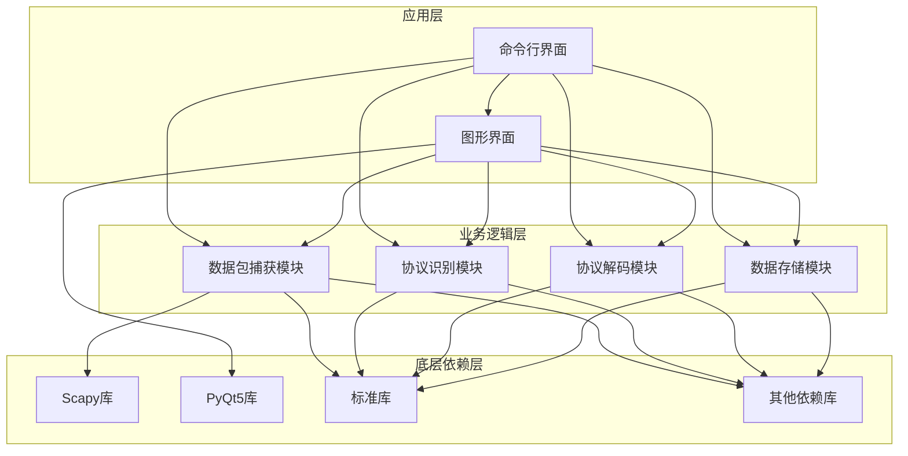

```mermaid
flowchart TD
    subgraph 应用层
    A[命令行界面] --> B[图形界面]
    end

    subgraph 业务逻辑层
    C[数据包捕获模块]
    D[协议识别模块]
    E[协议解码模块]
    F[数据存储模块]
    end

    subgraph 底层依赖层
    G[Scapy库]
    H[PyQt5库]
    I[标准库]
    J[其他依赖库]
    end

    A --> C
    A --> D
    A --> E
    A --> F
    B --> C
    B --> D
    B --> E
    B --> F
    B --> H
    C --> G
    C --> I
    D --> I
    E --> I
    F --> I
    C --> J
    D --> J
    E --> J
    F --> J
```